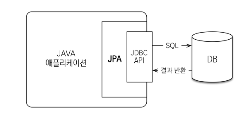

# Jani Project : Spring Tomcat WAS(Web Application Server)

`Jani Project Client GitHub`
https://github.com/NaJunYeop/Project_Jani_Spring_Boot_Websocket_Server

## Use

- SpringBoot
- WebSocket Protocol
- STOMP Protocol over Websocket
- JPA
- MySQL
- HttpRequest
- Tomcat

  

> ## SpringBoot

### Why SpringBoot ?
---
 개발의 효율을 더하기 위해 `SpringBoot` 프레임워크를 사용했습니다. 애플리케이션을 신속하게 설정하고, 스프링 구동 애플리케이션을 빌드하기 위한 기본 구성을 제공하는 유틸리티이기에 개발의 효율을 더할 수 있었습니다. 또한, `MVC 패턴`을 적용하기에 효율적이었습니다.

`의존성 주입(DI, Dependency Injection)`과 `제어의 역전(IOC, Inversion Of Control)`은 스프링에서 가장 중요한 특징 중 하나입니다. 좀 더 **결합도를 낮추는 방식**으로 어플리케이션을 개발할 수 있습니다. 이러한 개발방식으로 개발한 응용프로그램은 단위테스트가 용이하기 때문에 보다 퀄리티 높은 프로그램을 개발할 수 있었습니다.
  
### SpringBoot vs Spring
---

`Spring 프레임워크`는 기능이 많은 만큼 환경설정이 복잡한 편입니다. `SpringBoot`는 Spring 프레임워크를 사용하기 위한 **설정의 많은 부분을 자동화**하여 사용자가 정말 편하게 Spring을 활용할 수 있도록 돕습니다. Spring boot starter 디펜던시만 추가해주면 바로 API를 정의하고, 내장된 톰캣이나 제티로 웹 애플리케이션 서버를 실행할 수 있습니다. 심지어 Spring 홈페이지의initializer를 사용하면 바로 실행 가능한 코드를 만들어줍니다. 실행환경이나 의존성 관리 등의 인프라 관련 등은 신경 쓸 필요없이 바로 코딩을 시작하면 됩니다. 그 것이 바로 key point입니다. 정리하면 다음과 같습니다.

1. 임베디드 톰캣(Embed Tomcat), 제티, 언더토우를 사용하여 **독립 실행이 가능한 Spring 어플리케이션 개발**
2. **통합 starter**를 제공하여 메이븐/그래들 구성 간소화
3. starter를 통한 **자동화된 Spring 설정** 제공
4. 번거로운 XML설정을 요구하지 않음
5. JAR을 사용하여 자바 옵션만으로도 배포 가능
6. 애플리케이션의 모니터링과 관리를 위한 **스프링 액츄에이터(Spring Actuator)** 제공
7. **간단한 어노테이션 설정**이나 **프로퍼티 설정**으로 세부적인 설정 없이 원하는 기능을 빠르게 적용할수 있습니다.

단점 ) 같은 서버 포트번호로 다르게 배포 시 (서로 다른 프로젝트) boot 버전을 맞춰야 합니다.

  
### SpringBoot Features
---
* Container 
Spring Framework에서는 `BeanFactory`와 이를 상속한 `ApplicationContext` 두 가지 유형의 컨테이너를 제공합니다.
 

`BeanFactory`
 
**스프링 설정 파일**(applicationContext.xml)에 등록된 **bean 객체를 생성하고 관리하는 기능 제공을 제공**합니다. 컨테이너가 구동될 때 객체를 생성하는 것이 아니라, **클라이언트로의 요청에 의해서만 객체를 생성**합니다.
 
`ApplicationContext` 
**컨테이너가 구동되는 시점에 bean에 등록되어 있는 클래스를 객체화**합니다(Eager Loading). 트랜잭션 관리나 메시지 기반의 다국어 처리 등 다양한 기능을 지원합니다.

* IoC / DI (Inversion of Control / Dependency Injection)  
`“Inversion of Control” IoC`는 객체 생성을 자바 코드로 직접 처리하는 것이 아니라 **Container가 대신 처리**하게 합니다. 그와 동시에 객체와 객체 사이의 **의존관계 역시 Container가 처리**합니다.
  
`“Dependency Injection”`이란 뜻으로, 의존성 주입이란 말로 번역될 수 있습니다. 즉, 코드 상에서 사용자가 new 키워드로 객체를 생성하고 다른 객체와 관계를 설정하는 것이 아니라, **Spring Framework의 Container가 객체 간 의존관계**를 설정합니다.

* AOP (Aspect Oriented Programming) 
DI가 객체 간 의존성을 주입한 거라면, **AOP는 Logic 주입**이라고 할 수 있습니다.
AOP의 주 목적은 “**다수의 모듈에 공통적으로 나타나는 부분을 제거하는 것**”입니다. 반복적인 Logic을 공통 Logic으로 분리하면, 응집도를 높게 가져갈 수 있습니다. **AOP 또한 xml과 Annotation을 이용해서 설정**할 수 있습니다.

* PSA (Portable Service Abstraction) 
`JDBC`처럼 `Adapter 패턴`을 적용하여 같은 일을 하는 다수의 기술을 공통 인터페이스로 제어할 수 있게 한 것을 **서비스 추상화**라고 합니다. `Spring Framework`에서는 서비스 추상화를 위해 다양한 어댑터를 제공합니다. Spring Framework은 `OXM`, `ORM`, `Cache`, T`ransaction` 등 다양한 기술에 대한 `PSA`, 즉 **API 를 제공**합니다.
  

### SPRING FRAMEWORK 내부 동작 원리
---

1. Web Application 실행 `Tomcat(WAS)`에 의해 `web.xml`이 loading됩니다.
2. `web.xml`에 등록되어있는 `ContextLoaderListener` (ServletContextListener 구현, ApplicationContext생성 역할)가 생성됩니다.
3. 생성된 `ContextLoader`는 `root-context.xml`을 Loading.
4. Root-context.xml에 등록되어 있는 `Spring Container`가 구동됩니다. 이때 DAO, VO 객체들이 생성됩니다.
5. **Client로**부터 `Request` 요청이 옵니다.
6. `DispatcherServlet(Servlet)`이 생성됩니다. (DispatcherServlet은 Client의 요청을 Controller로 분기합니다. – Handler-Mapping)
7. `DispatcherServlet`은 `servlet-context.xml`을 Loading.( DispatcherSevlet은 독립된 Context를 구성하면서 서로 참조불가.)
8. 두번째 `Spring Container`가 구동되며 응답에 맞는 Controller들이 동작합니다. 이때 첫번째 Spring Container가 구동 시작됩니다.

  

> ## WebSocket

### Why WebSocket?
---
`WebSocket`은 **Transport protocol**의 일종입니다. 서버와 클라이언트 간에 **socket connection**을 유지해서 언제든 **양방향 통신** 또는 **데이터 전송**이 가능하도록 하는 기술입니다. 따라서 우리는 `채팅 기능`을 구현할 때 `WebSocket` 프로토콜을 사용했습니다.

  

### WebSocket (Stateful protocol) VS HTTP(Request/Response 기반Stateless protocol)
---

웹어플리케이션에서 기존의 서버와 클라이언트 간의 통신은 대부분 `HTTP`를 통해 이루어 졌으며 **HTTP는 Request/Response 기반의Stateless protocol**입니다. 즉, 서버와 클라이언트 간의 Socket connection 같은 **영구적인 연결이 되어 있지 않고** 클라이언트 쪽에서 (예를 들어 웹브라우저 쪽에서) **필요할 때 Request를 할 때만 서버가 Response를 하는 방식으로 통신이 진행되는 프로토콜**이란 뜻입니다. 서버 쪽 데이터가 업데이트되더라도  클라이언트 쪽 (예를 들어 웹페이지)에는 화면을 **Refresh 하지 않는 한 바뀐 데이터가 업데이트가 되지 않는 문제**가 발생합니다.

**데이터의 빠른 업데이트가 아주 중요한 요소** 중에 하나인 어플리케이션 (예를 들어 주식 관련 사이트라던가 비디오 채팅 어플리케이션)에서는 실시간 업데이트가 아주 중요하기 때문에 (그리고 기존의 Long Polling 같은 기술은 서버에 많은 부담을 주는 부작용이 있기 때문에) `WebSocket`이 아주 유용하고 중요한 기술로 사용되고 있습니다.

또한 `WebSocket`은 **Stateful protocol**이기 때문에 클라이언트와 한 번 연결이 되면 계속 같은 라인을 사용해서 통신을 하기 때문에 HTTP 사용 시 필요없이 발생되는 HTTP와 TCP 연결 트래픽을 피할 수 있습니다. 

마지막으로 WebSocket은 HTTP와 같은 포트 (80)을 사용하기 때문에 (Secure한 채널 같은 경우에는 HTTPS와 같은 443을 이용) 기업용 어플리케이션에 적용할 때 방화벽을 재설정하지 않아도 되는 장점도 있습니다. (대부분의 기업 방화벽은 외부에서의 접속은 HTTP나 HTTPS만을 기본으로 허용하고 있으며 만약 이외의 포트를 허용해야 할 경우에는 방화벽의 설정을 수정해야 하는데 큰 회사일 수록 방화벽 설정 수정 절차가 복잡하기 때문에 HTTP와 같은 포트를 사용한다는 점이 꽤 큰 장점이 될 수도 있습니다.)
  

### WebSocket 동작 원리
---

우선 **서버와 클라이언트 간의 WebSocket 연결은 HTTP 프로토콜을 통해 이루어집니다.** 만약 연결이 정상적으로 이루어진다면 서버와 클라이언트 간에 `WebSocket 연결` (TCP/IP 기반으로 하는)이 이루어지고 일정 시간이 지나면 **HTTP 연결은 자동으로 끊어집니다.**
기본적으로 WebSocket API는 아주 간단한 기능들만을 제공하기 때문에 대부분의 경우 SockJS나 Socket.IO 같은 오픈 소스 라이브러리를 많이 사용하고 있으며 메세지 포멧 또한 `STOMP` 같은 프로토콜을 같이 이용합니다. 마지막으로 스프링 프레임워크도 WebSocket을 간단한 메세지 브로커랑 SockJS 그리고 STOMP와 같이 지원하고 있습니다.
  

<Jani_Server_WebSocketConfiguration>

WebSocketConfig.java
~~~java
package com.example.demo.configuration;

import org.springframework.context.annotation.Configuration;
import org.springframework.http.converter.json.MappingJackson2HttpMessageConverter;
import org.springframework.messaging.simp.config.MessageBrokerRegistry;
import org.springframework.web.socket.config.annotation.EnableWebSocketMessageBroker;
import org.springframework.web.socket.config.annotation.EnableWebSocket;
import org.springframework.web.socket.config.annotation.StompEndpointRegistry;
import org.springframework.web.socket.config.annotation.WebSocketMessageBrokerConfigurer;

@Configuration
@EnableWebSocket
@EnableWebSocketMessageBroker
public class WebSocketConfig implements WebSocketMessageBrokerConfigurer {

    @Override
    public void configureMessageBroker(MessageBrokerRegistry config) {
    	config.setApplicationDestinationPrefixes("/app");
        config.enableSimpleBroker("/topic", "/queue", "/req");
    }

    @Override
    public void registerStompEndpoints(StompEndpointRegistry registry) {
    	registry.addEndpoint("/janiwss").withSockJS();
    }
}
~~~
  

### RabbitMQ (추후 도입 예정)
---

`RabbitMQ`는 AMQP(Advanced Message Queing Protocol)을 구현한 **메시지 브로커**입니다. `AMQP`라는 표준MQ 프로토콜로 만들어 져있고 **Cluster구성이 쉽고 ManageUI가 제공**되며 무엇보다 성능이 뛰어나다고 알려져 현재 많이 사용되고 있습니다. 또한 ManagementUI, Autocluster, MQTT Convert, STOMP 등의 plugin도 제공되어 확장성이 뛰어나며 Spring에서도 AMQP연동 라이브러리가 제공되어 편리하게 연동하여 사용가능합니다.

> ## JPA
 

### Why JPA?
---
`Jani` Server단에서는 **DB를 컨트롤**하기 위해 `JPA`를 사용했습니다. 이유는 다음과 같습니다. `JPA`는 **자바 객체와 DB 테이블 사이의 매핑 설정을 통해 SQL을 생성**합니다. 보통 `JDBC`를 사용하여 개발을 하다보면 코드가 비슷한 형태로 반복되게 됩니다. DB커넥션을 구하고, 쿼리를 작성하고, 파라미터를 설정하고 실행한 결과를 자바 객체에 설정합니다. 여기서 문제점은 테이블의 컬럼명이 추가, 삭제, 변경이 된다면 관련되어 있는 모든 쿼리를 수정해야 할 것인데 `JPA`는 **매핑 설정만 변경**하면 됩니다. 또한 **실행한 쿼리를 자바 객체에 설정해줘야 하는데 JPA는 자바 객체로 매핑하여 검색**할 수 있습니다. 즉 **유지보수**가 쉽습니다. 객체를 통해 쿼리를 작성할 수 있는 `JPQL`(Java Persistence Query Language)를 지원합니다.
  

### JPA & Hibernate
---
`JPA`란 **DB 테이블과 자바 객체 사이의 매핑**을 처리해주는 ORM1이란 기술의 표준입니다. 따라서 JPA에는 객체와 DB 사이의 매핑을 어떻게 설정하고 어떻게 동작해야하는지 기술하고 있습니다. 즉 자바의 클래스와 DB의 테이블을 매핑하는 기술이란 뜻입니다.

`JPA`를 살펴보다면 `하이버네이트(hibernate)`란 말을 많이 접하게 됩니다. `hibernate` 란 **JPA 프로바이더**의 한 종류입니다. `JPA` 프로바이더는 `JPA`의 표준을 실제로 구현하고 있습니다. **쉽게 말하자면 `JPA`는 DB와 자바 객체를 매핑하기 위한 인터페이스(API)를 제공하고 JPA 프로바이더는(`hibernate`) 이 인터페이스를 구현한 것 입니다.**

  

### JPA 동작원리
---

`JPA`는 애플리케이션과 `JDBC` 사이에서 동작합니다. 개발자가 `JPA`를 사용하면, `JPA` 내부에서 `JDBC` API를 사용하여 SQL을 호출하여 DB와 통신합니다. 즉, 개발자가 직접 `JDBC` API를 쓰는 것이 아닙니다.

 

<Jani_Server_register_model_entity>

ServRegisterModel.java

~~~java
@Entity
@Table(name="register_model_entity")
public class ServRegisterModel {
	
	@Id
	@GeneratedValue(strategy=GenerationType.IDENTITY)
	@Column(name="serv_reg_id")
	private Integer servRegId;
	
	@Column(name="reg_id")
	private Integer regId;	
	
	@Column(name="reg_user_name")
	private String regUserName;
	
	@Column(name="reg_password")
	private String regPasswrod;
}
~~~

 

MySQLController.java

~~~java

@RequestMapping(value="/get-topic-channel", method=RequestMethod.POST)
	@ResponseBody
	public PlainTextModel getTopicNumber() {
		
		PlainTextModel ret = new PlainTextModel();
		queryServTopicNumberModel = ServTopicNumberRepository.findById(1);
		
		//topic_nubmer없으면 .save
		if(!queryServTopicNumberModel.isPresent()) {
			ServTopicNumberRepository.save(new ServTopicNumberModel(1));
			ret.setText("0");
			logger.info("/get-topic-channel : clientTopicNumber = " + ret.getText()+ "/get-topic-channel : serverTopicNumber = 1");
			return ret;
		}
		
		//있으면 +1
		
		int clientTopicNumber = queryServTopicNumberModel.get().getTopicNumber();
		int serverTopicNumber = clientTopicNumber + 1;
		ServTopicNumberRepository.deleteAll();
		ServTopicNumberRepository.save(new ServTopicNumberModel(serverTopicNumber));
		
		//log찍어 보기
		logger.info("/get-topic-channel : clientTopicNumber = " + clientTopicNumber + "/get-topic-number : serverTopicNumber = " + serverTopicNumber);
		ret.setText(Integer.toString(clientTopicNumber));
		return ret;
	}

~~~

Ex) MemberDAO에서 객체를 저장하고 싶을 때 개발자는 `JPA`에 Member 객체를 넘깁니다.
JPA는
1) Member 엔티티를 분석합니다.
2) **INSERT** SQL을 생성합니다.
3) `JDBC` API를 사용하여 SQL을 DB에 날립니다.

Ex) Member 객체를 조회하고 싶을 때
개발자는 member의 pk 값을 `JPA`에 넘깁니다.
JPA는
1) 엔티티의 매핑 정보를 바탕으로 적절한 **SELECT** SQL을 생성한다.
2) `JDBC` API를 사용하여 SQL을 DB에 날린다.
3) DB로부터 결과를 받아온다.
4) 결과(ResultSet)를 객체에 모두 매핑한다.
쿼리를 JPA가 만들어 주기 때문에 Object와 RDB 간의 패러다임 불일치를 해결할 수 있다.

 

> ## MySQL

### Why MySQL?
---

DB구축에 앞서 `RDB`와 `NoSQL`을 고민했고 `Jani 프로젝트`에서 DB로 `RDB`인 `MySQL`을 사용했습니다. 그 이유는 **명확하게 정의된 스키마**, **데이터 무결성**을 보장하기 때문입니다. `Jani 프로젝트`의 **DB와 Table은 스키마가 구체적**이었으며 **각 Table은 관계를 맺고 동작**하기 때문에 운영과 수정 및 유지보수의 용이함을 위해서 `RDB`를 선택하였습니다. `RDB`와 `NoSQL`의 특징은 다음과 같습니다.
  

### RDB vs NoSQL
---
`RDB(Relational Database)`

1) 테이블(Table) 마다 **스키마**(Schema)를 정의해야 됩니다.
2) **데이터 타입**과 **제약**(Constraint)를 통해서 **데이터의 정확성을 보장**합니다.
3) **SQL 질의문**을 통해 요청을 처리합니다.
4) 성능을 높이려며 하드웨어(H/W)를 고성능으로 교체해야 된다. (**Scale Up**)
5) 고성능 하드웨어는 가격이 비싸기 때문에, RDB의 성능을 높이거나 **확장하기 어렵기 때문에 확장성에 좋지 않습니다.**

`NoSQL(Not only SQL)`

대표적으로 `mongoDB`, `hBase` 등이 있으며, `mongoDB`의 경우 **문서(document)형 데이터베이스**이며, 많이 알려진 DB중 하나입니다. 그리고, `hBase` 같은 경우는 빅데이터 처리를 한다고 하면 누구나 한번쯤은 들어봤을 법한 DB입니다.

1) `RDB`의 **확장성 이슈를 해결**하기 위해 나온 데이터베이스 모델입니다.
2) **분산 컴퓨팅 활용이 목적**이고, 이것을 통해 비교적 저렴한 가격으로 DB 성능을 높일 수 있습니다. (**Scale Out**)
3) 여러 개의 테이블이 아닌, **큰 테이블 하나만**을 사용합니다.
4) 가장 많이 쓰이는 `NoSQL`의 방식은 **key-value**방식으로 데이터를 관리합니다.
5) SQL 질의문을 사용하지 않습니다.
6) **Schema-less** (구조 변경이 용이하고, 데이터 형식이 다양하며, 바꾸기 쉬우며, 정확성 보다는 데이터 양이 중요한 빅데이터(Big Data)에 사용합니다.
7) 대표적으로 `MongoDB`(document-oriented), `redies`(key-value) 등이 있습니다.

  

### SQL 사용하는 경우
---

**관계를 맺고 있는 데이터가 자주 변경(수정)되는 애플리케이션**일 경우 (NoSQL에서라면 여러 컬렉션을 모두 수정해줘야만 합니다.) 변경될 여지가 없고, **명확한 스키마**가 사용자와 데이터에게 중요한 경우 사용합니다.

장점)
**명확하게 정의 된 스키마**, **데이터 무결성 보장**.
관계는 각 데이터를 **중복없이 한번만 저장**됩니다.

단점)
`NoSQL`에 비해 상대적으로 **유연하지 못합니다.** 데이터 스키마는 사전에 계획되고 알려져야 합니다. 관계를 맺고 있기 때문에, JOIN문이 많은 매우 복잡한 쿼리가 만들어 질 수 있습니다. **수평적 확장이 어렵고**, 대체로 **수직적 확장만 가능**합니다.

### NoSQL 사용하는 경우
---

**정확한 데이터 구조를 알 수 없거나** 변경 / 확장 될 수 있는 경우 사용합니다. **읽기(read)처리**를 자주하지만, 데이터를 **자주 변경(update)하지 않는 경우** 즉, 한번의 변경으로 수십 개의 문서를 업데이트 할 필요가 없는 경우, 데이터베이스를 **수평으로 확장**해야 하는 경우 즉, **막대한 양의 데이터**를 다뤄야 하는 경우사용합니다.

장점)
**스키마가 없기때문에, 훨씬 더 유연**합니다. 즉, 언제든지 저장된 데이터를 조정하고 새로운 "필드"를 추가 할 수 있습니다. 데이터는 애플리케이션이 필요로 하는 형식으로 저장됩니다. 이렇게 하면 데이터를 읽어오는 속도가 빨라집니다. 수직 및 수평 확장이 가능하므로 데이터베이스가 애플리케이션에서 발생시키는 모든 읽기 / 쓰기 요청을 처리 할 수 있습니다.

단점)
유연성 때문에, 데이터 구조 결정을 하지 못하고 미루게 될 수 있습니다. **데이터 중복**은 여러 컬렉션과 문서가 (SQL 세계에서 처럼 하나의 테이블에 하나의 레코드가 아니라) **여러 개의 레코드가 변경된 경우 업데이트**를 해야 합니다. 데이터가 여러 컬렉션에 중복되어 있기 때문에, **수정(update)를 해야 하는 경우 모든 컬렉션에서 수행**해야 함을 의미합니다. (SQL 세계에서는 중복된 데이터가 없기 때문에 한번만 수행하면 됩니다.)

  

> ## HttpRequest

### Why Http?
---
**Server**와 **Client**를 통신하는데 있어서 **아이디 중복 체크**, **아이디 등록**, **user 정보 불러오기**, **user 찾기**, **채팅 채널 요청** 기능을 구현하는데 사용했습니다. **유저들간**의 **실시간 통신**보다 **서버에 request를 보내고 response를 얻기** 때문에 `HttpRequest`를 활용했습니다. 이 때 요청 내용과 응답 내용 등을 노출하지 않기 위해 `POST`를 통해 데이터를 요청하였습니다. 
 

<Jani_Client(android)_SourceCode>

RetrofitCommunicationService.java
~~~java
public interface RetrofitCommunicationService {
    @POST("/duplication-check")
    Single<PlainTextModel> userNameDuplicationCheck(@Body String userName);

    @POST("/user-registration")
    Single<PlainTextModel> registerUserRegisterModelToServer(@Body RegisterModel registerModel);

    @POST("/find-user")
    Single<PlainTextModel> findUserInformationModel(@Body String userName);

    @POST("/get-user-info")
    Single<UserInformationModel> getUserInformationModel(@Body String userName);

    @POST("/get-topic-channel")
    Single<PlainTextModel> getTopicChannel();
}
~~~

<Jani_Server(SpringBoot_Tomcat)_SourceCode>

getUserInformationModel.java
~~~java
@RequestMapping(value="/get-user-info", method=RequestMethod.POST)
	@ResponseBody
	public UserInformationModel getUserInformationModel(@RequestBody PlainTextModel text) {
		queryServRegisterModel = servRegisterModelRepository.findByRegUserName(text.getText());
		
		logger.info("/get-user-info : User Name = " + text.getText());
		
		return new UserInformationModel(queryServRegisterModel.get());
	}
~~~
  
### Why POST? : GET vs POST
---

서버의 자원을 어떻게 사용하는지에 따라 `GET`, `POST` 방식을 많이 사용합니다.
1) `GET`

HTTP/1.1 스펙인 RFC2616의 Section9.3에 따르면 `GET`은 **서버로부터 정보를 조회하기 위해 설계된 메소드**입니다. `GET`은 요청을 전송할 때 필요한 데이터를 **Body에 담지 않고**, **쿼리스트링**을 통해 전송합니다. `URL`의 끝에 ‘`?`’와 함께 이름과 값으로 쌍을 이루는 요청 파라미터를 **쿼리스트링**이라고 부릅니다. 만약, 요청 파라미터가 여러 개이면 `&`로 연결합니다. 쿼리스트링을 사용하게 되면 `URL`에 조회 조건을 표시하기 때문에 특정 페이지를 링크하거나 북마크할 수 있습니다.

2) `POST`

`POST`는 리소스를 생성/변경하기 위해 설계되었기 때문에 `GET`과 달리 전송해야될 데이터를 **HTTP 메세지의 Body**에 담아서 전송합니다. `HTTP` 메세지의 `Body`는 길이의 제한없이 데이터를 전송할 수 있습니다. 그래서 `POST` 요청은 `GET`과 달리 **대용량 데이터**를 전송할 수 있습니다. 이처럼 `POST`는 데이터가 `Body`로 전송되고 내용이 눈에 보이지 않아 `GET`보다 보안적인 면에서 안전하다고 생각할 수 있지만, `POST` 요청도 크롬 개발자 도구, Fiddler와 같은 툴로 요청 내용을 확인할 수 있기 때문에 민감한 데이터의 경우에는 반드시 **암호화해 전송**해야 합니다.

그리고 `POST`로 요청을 보낼 때는 요청 헤더의 Content-Type에 요청 데이터의 타입을 표시해야 합니다. 데이터 타입을 표시하지 않으면 서버는 내용이나 URL에 포함된 리소스의 확장자명 등으로 데이터 타입을 유추합니다. 만약, 알 수 없는 경우에는 application/octet-stream로 요청을 처리합니다.

3) `Restful`

`Jani 프로젝트`는 데이터만 보내면 여러 클라이언트에서 해당 데이터를 적절히 보여주기만 하면 되기 때문에 `Restful` 아키텍처를 적용했습니다. 예를 들어 모바일 애플리케이션으로 html같은 파일을 보내는 것은 무겁고 브라우저가 모든 앱에 있는 것은 아니기 때문에 알맞지 않았는데 RESTful API를 사용하면서 데이터만 주고 받기 때문에 여러 클라이언트가 자유롭고 부담없이 데이터를 이용할 수 있습니다. `Jani`는 Server단에서 Client단에 요청한 데이터만 보여주면 되기 때문에 Restful을 도입했습니다. 서버도 요청한 데이터만 깔끔하게 보내주면되기 때문에 가벼워지고 유지보수성도 좋아졌습니다.

`Restful`은 **REpresentational State Transfer**의 약자입니다. 이것은 장비간 통신을 위해 CORBA, RPC, SOAP등의 복잡한 방법을 사용하는 대신, 간단하게 `HTTP`를 이용하는 것이 목적입니다. `REST`는 자원 지향 구조(Resource Oriented Architecture)로 웹 사이트의 이미지, 텍스트, DB 내용 등의 모든 자원에 고유한 `URI`를 부여합니다. `HTTP URI`를 통해 resource를 명시하고 `HTTP Method(GET, POST, PUT, DELETE)`를 통해 해당 resource에 대한 `CRUD operation`을 적용하는 것입니다. 즉 **REST는 HTTP Method를 통해 resource를 처리하도록 설계된 아키텍처**를 뜻합니다.

> ## Tomcat

### Why Tomcat?
---

 앱 어플리케이션의 **Dynamic**(동적)인 동작을 위해 `Tomcat`을 사용했습니다. `SpringBoot`를 사용해 내장 `Tomcat`을 활용할 수 있었습니다.

`Tomcat`은 **웹 서버와 연동하여 실행할 수 있는 자바 환경을 제공**하여 자바 서버 페이지(`JSP`)와 자바 `서블릿`이 실행할 수 있는 환경을 제공하고 있습니다. `Tomcat`은 관리툴을 통해 설정을 변경할 수 있지만, XML 파일을 편집하여 설정할 수도 있습니다. 그리고, `Tomcat`은 `HTTP` 서버도 자체 내장하기도 합니다.

`Tomcat`은 `웹Server`와 `웹Container`의 결합으로, 다양한 기능을 Container에 구현하여 다양한 역할을 수행할 수 있는 서버인 `WAS`(Web Application Service)라고 합니다.

> ## Reference

https://tutledeveoper.wordpress.com/2018/07/22/spring-boot-%EA%B8%B0%EB%B3%B8-%EA%B5%AC%EC%A1%B0-%EC%95%8C%EC%95%84%EB%B3%B4%EA%B8%B0/

https://skibis.tistory.com/310

https://gmlwjd9405.github.io/2019/08/04/what-is-jpa.html

https://joshua1988.github.io/web-development/http-part1/

https://wodonggun.github.io/wodonggun.github.io/study/%EC%95%84%ED%8C%8C%EC%B9%98-%ED%86%B0%EC%BA%A3-%EC%B0%A8%EC%9D%B4.html

